# Знакомство с программой

## С чего начать работу на платформе «Клиентская база»?

Вы создали аккаунт на платформе «Клиентской базы». Перед вами фактически чистый лист, который не терпится персонализировать и настроить под себя. В этом уроке расскажем, как устроен интерфейс, как заполнить данные компании, добавить сотрудников, загрузить логотип и настроить цветовую схему.

## Краткое вступление

[Платформа «Клиентская база»](https://clientbase.ru/index.html) — это кроссплатформенный конструктор, на основе которого вы сможете создать персонализированную CRM-систему. Гибкие настройки позволяют легко адаптировать программу под нужды любой организации или индивидуального предпринимателя.

Работать с программой может один пользователь или несколько групп пользователей с разными правами доступа. Количество доступных пользователей в программе зависит от тарифов [коробочной лицензии](https://clientbase.ru/buy/buy_new_licence.1.html) или [облачной версии](https://clientbase.ru/buy/account_rental.html). Бесплатная веб-версия рассчитана на десять пользователей.

В стандартной конфигурации программы вы можете:

* Хранить данные о клиентах и историю работы с каждым из них.
* Закреплять клиентов за сотрудниками (менеджерами).
* Распределять задания между сотрудниками.
* Выписывать счета.
* Принимать заявки.
* Просматривать отчеты и журналы, в программе они называются «логи».
* Рассылать клиентам электронные письма и смс.
* Устанавливать напоминания о важных событиях и так далее.
 

Преимущество программы — интуитивно понятный встроенный конструктор. С помощью него вы можете самостоятельно без навыка программирования настроить конфигурацию под ваш бизнес. Например, создавать любые дополнительные таблицы и поля, напоминания, фильтры, группы доступа, шаблоны документов в форматах PDF, RTF, ODT, HTML.

На рынке есть похожие решения на CRM-конструктор «Клиентская база». Однако, они позволяют добавлять только отдельные поля в конкретные таблицы. Например, новое поле в таблицу клиентов. В нашей программе вы можете создавать любые таблицы, используя 9 типов полей: текст, число, список, связь, дата, файл, изображение, пользователь и группа.На нашем сайте мы разместили [подробный обзор всех возможностей платформы](https://clientbase.ru/document.1.html), вы можете подробно изучить их после прохождения этого урока.

Команда программистов «Клиентской базы» постоянно работает над расширением функционала системы — мы отслеживаем мировые тенденции в области автоматизации бизнес-процессов и всегда учитываем пожелания наших клиентов. Сотрудничая с нами, вы можете рассчитывать на постоянное обновление системы и появление в ней дополнительных возможностей.

__Начните работать с программой «Клиентская база» — и у вас под рукой всегда будет гибкая система, функционал которой расширяется параллельно с развитием вашего бизнеса.__

## Интерфейс платформы «Клиентская база»

Сразу после создания аккаунта в CRM-системе «Клиентская база» вы попадаете на рабочий стол программы. Здесь отображаются основные кнопки для работы с системой: «Добавить клиента», «Выписать счет», «Назначить задание», «Добавить сотрудника».     

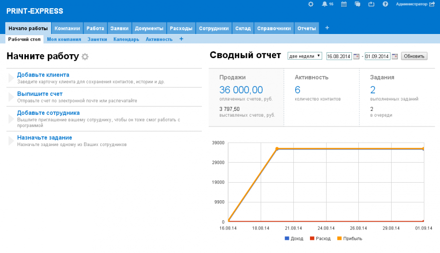

Помимо кнопок мы также разместили сводный отчет продаж и график по нему, количество клиентов компании и выполненных заданий. Чтобы посмотреть прибыль за прошлый месяц или год — установите период вверху страницы и нажмите на кнопку «Обновить».   

Следующая вкладка на рабочем столе — «Компании» с подразделом «Контрагенты». Здесь вы можете разместить всю информацию о клиентах в табличном виде.  

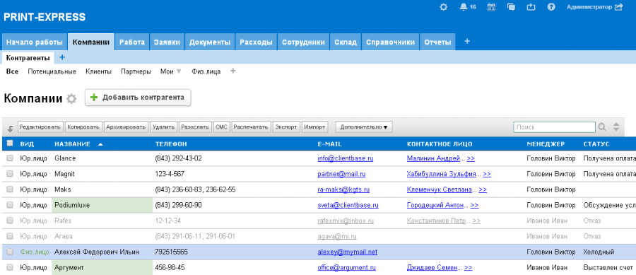

Чтобы просмотреть информацию о клиенте, вам нужно выбрать и нажать на его поле в таблице. Сразу после этого откроется карточка клиента с его данными.  

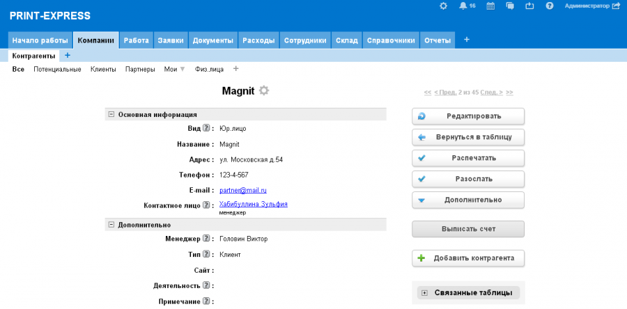

Мы сделали интерфейс системы максимально простым, чтобы вы не отвлекались от работы. Все данные представлены в табличном виде, как и в электронных таблицах как MS Excel. Однако, здесь вы можете войти внутрь каждой записи и просмотреть те поля, которые не отображаются в основной таблице. 

При регистрации в программе первый пользователь становится администратором. Он назначает какие поля будут отображаться в таблице и какие записи для каждой группы сотрудников в системе. Администратор может добавлять, удалять, редактировать любые поля в любой таблице, а также создавать свои таблицы и категории.

Все страницы программы, кроме настроек, делятся на три типа:

* Таблица — это данные в табличном виде. 
* Представление (или отчет) — это данные в свободной форме, которые может создавать пользователь с необходимыми правами. Примеры представлений: отчет, график, калькулятор и т. д. 
* Календарь — это данные из таблиц, представленные в визуальной форме. 

__Таблицы.__ Вот так выглядит стандартный вид таблицы. В качестве примера мы взяли таблицу «Сотрудники».

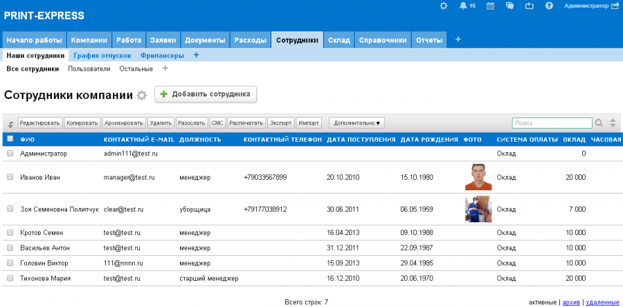

Начиная с версии 2.0.3 в программе появилась опция «стрелка» возврата в начало записей таблиц, чтобы вам не приходилось прокручивать все записи. При просмотре какой-либо таблицы с записями она появляется в верхнем левом углу. 

Например, в таблице «Счета» много полей. Вы прокрутили страницу вниз, чтобы найти нужное поле и теперь нужно вернуться обратно. 

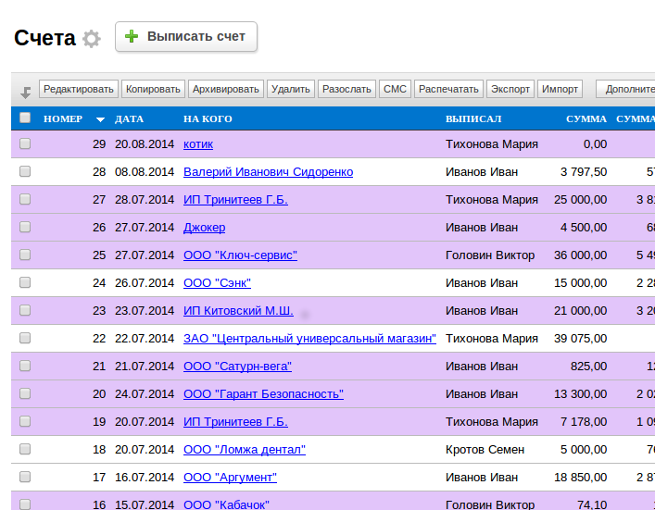

Кликните на стрелку в левом верхнем углу экрана и вы сразу переместитесь в начало таблицы. 

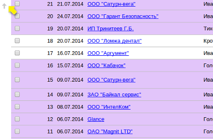

Примерно вот так выглядит выглядит отчет компании. Вы можете создавать свои отчеты и отслеживать метрики в бизнесе, которые нужны конкретно вам.

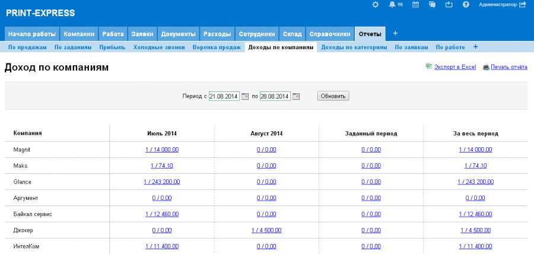

В программе есть свой календарь, где вы можете планировать важные события для компании, ставить задачи сотрудникам и отслеживать встречи и звонки менеджеров с клиентами.

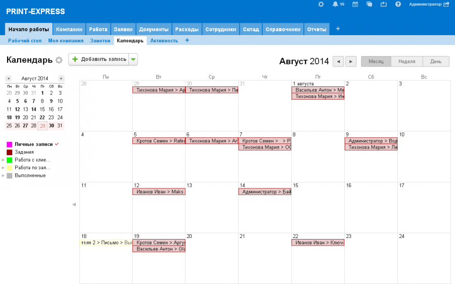

## Разбор интерфейса CRM-системы «Клиентская база»

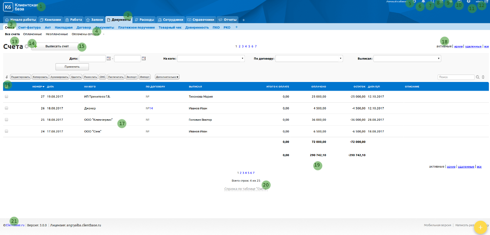

1. __Заголовок__ программы и логотип. Вы можете загрузить в программу логотип и ввести название своей компании. Во время работы они всегда будут отображаться в левом верхнем углу экрана. Таким образом, вы сможете настроить айдентику программы под себя. 

2. __Категории таблиц.__ Для удобства можно группировать таблицы по категориям.

3. __Таблицы.__ Таблицы с данными, которые вы можете создать и заполнить.

4. __Фильтры.__ С их помощью вы сможете сделать выборку из таблиц по различным условиям. Например, в таблице «Клиенты» можно сделать фильтры: «новые клиенты», «важные клиенты», «мои клиенты» и так далее. Фильтры создает и редактирует администратор в настройках программы.

5. __Настройки.__ Один из самых больших разделов программы. Он содержит множество подразделов, о них мы будем рассказывать постепенно в течение всех уроков.

6. __Напоминания.__ Этот раздел хранит все уведомления, приходящие в программе пользователю.

7. __Глобальный поиск.__ Поиск необходимой информации по всем таблицам программы.

8. __Календарь.__ Содержит ссылки на календари программы и показывает количество событий на сегодня и завтра. 

9. __Сообщения.__ Этот раздел позволяет общаться с пользователями внутри сети как в личном, так и в общем чатах. История переписок сохраняется автоматически.  

10. __Бизнес-процессы.__ Этот раздел содержит в себе специально созданный обучающий бизнес-процесс «Знакомство с «Клиентской базой». Там также можно создавать свои и редактировать существующие бизнес-процессы.

11. __Помощь.__ В этом разделе мы разместили информацию о программе, справку и форму обратной связи с технической поддержкой. 

12. __Имя пользователя и выход/вход.__ Показывает имя пользователя, который вошел в систему. Нажав на «Выход», вы переместитесь в окно авторизации.

13. __Заголовок таблицы.__ Вы можете устанавливать свои заголовки, какие пожелаете. 

14. __Шестеренка.__ Быстрый переход к редактированию настроек текущей таблицы. Этот инструмент отображается только у пользователя с группой доступа «Администратор» в режиме разработчика. 

15. __Кнопка «Выписать счет», название по умолчанию «Добавить строку».__ С помощью этой нее вы можете добавлять записи в текущую таблицу. Администратор также может изменить название кнопки по желанию.

16. __Кнопки действия над строками.__ С помощью кнопок «Копировать», «Архивировать», «Удалить», «Разослать», «Смс», «Распечатать», «Экспорт», «Импорт», «Дополнительно» вы можете производить действия над выделенными строками в таблице. Отображение кнопок для разных групп доступа устанавливается администратором.   Если в таблице много записей — при выделении всех записей на одной странице появится системное сообщение. Система предложит выделить все записи в таблице или только те, что были отмечены на текущей странице   Если нажать «Ок» — выделятся все записи таблицы, на каждой ее странице, если нажать «Отмена» — будут выделены только записи на текущей странице.

17. __Поля и строки таблицы.__ Вы можете решить какие столбцы и с какой информацией будут отображаться на «главной». В строках отображаются самые важные данные из ваших записей в таблице.  

18. __Переключатель: активные, архив, удаленные, все.__ Строки в программе имеют четыре статуса, после удаления строки помещаются в раздел  «удаленные», оттуда  «удалить без возможности восстановления» их может только администратор.    Вкладка «все» в таблице выводит все записи таблицы, в том числе из фильтров «активные», «архив» и «удаленные».
   Вкладки «активные», «архив», «удаленные» и «все» отображаются вначале и вконце таблицы в верхнем правом углу. .Это сделано для более удобной работы с записями. Бывает так, что в таблице содержится много записей и пользователям неудобно проматывать всю страницу, чтобы перейти во вкладку «удаленные» или «архив».

19. __Автосумма.__ Подсчитывает суммарное значение полей типа «Число». Черным цветом отмечается сумма на открытой странице, серым цветом — сумма на всех страницах.

20. __Справка по таблице.__ Содержит информационные справки по таблице, ее полям, фильтрам и информерам.  

21. __Номер версии и знак копирайта.__ Знак копирайта «Клиентская база» присутствует во всех версиях программы и может быть отключен по желанию клиента за дополнительную оплату.

## Заполнение данных компании

Одна из первых настроек, которую стоит сделать — заполнить данные о компании.

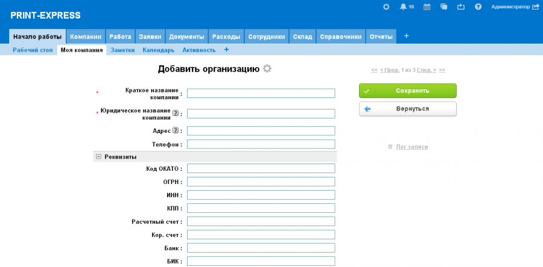

В категории «Начало работы» зайдите в таблицу «Моя компания», нажмите кнопку «Добавить организацию» и заполните поля. 

В поле «Краткое название компании» введите короткое обозначение для своей компании, оно будет использоваться только в программе «Клиентская база» в качестве удобного обозначения. 

Данные из полей в карточке автоматически подставляются во все документы, которые вы будете выписывать — счета, договора и другие. Если у вас нет реквизитов, заполните просто название организации. 

В поле «Ставка НДС» впишите ставку НДС для вашей компании — она автоматически будет просчитываться в документах. Если вы работаете без НДС, поставьте значение поля «НДС включен в стоимость» — не учитывать.

Вы можете загрузить отсканированные печать и подпись компании, чтобы кроме стандартного шаблона счета можно было сформировать также документы с печатью компании и подписями директора и бухгалтера. 

Юридической силой такие документы не обладают и бухгалтерия ваших клиентов, скорее всего, потребует оригиналы — но для отсылки счета по электронной почте этого вполне достаточно. При этом время на выписку счета сократится в несколько раз.

Если вы не знаете, значения полей и реквизитов, вы всегда можете сохранить запись, добавить или отредактировать нужные поля в будущем.

В качестве вашей компании, можно добавить не одну, а любое количество компаний. Бывает, что одна компания имеет в своем составе несколько юридических лиц, например: ООО «Ромашка», ООО «Ромашка +» и ИП Ромашкин А.А. 

Вы можете добавить все нужные компании в таблицу «Моя компания» с реквизитами, печатями и подписями. При выписке документов нужно будет просто выбирать от лица какой компании их нужно выписывать.

## Загрузите логотип и настройте цветовую гамму

Приятно работать в системе, которая настроена под корпоративный стиль организации.

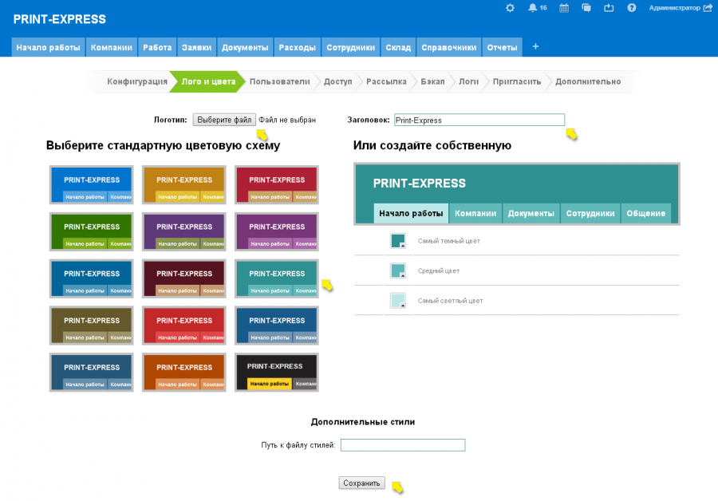

Изменить стандартный стиль программы можно в настройках. Нажмите на «шестеренку» в правом верхнем углу, выберите раздел «Лого и цвета». 

В графе «Заголовок» введите название компании, оно будет отображаться в левом верхнем углу окна. Загрузите файл с логотипом — нажмите на кнопку «Выберите файл» и в новом диалоговом окне выберите файл на компьютере. 

Размеры размещенного логотипа будут совпадать с размерами файла. Поэтому заранее вырежите или оптимизируйте размер файла. Логотип поддерживает форматы: JPG, GIF, PNG. Чтобы логотип был на прозрачном фоне — вырежите фон и сохраните его в формате PNG. 

Цветовую схему вы можете выбрать из предложенных или задать в системе свои цвета. После этого нажмите на кнопку «Сохранить», и внесенные вами изменения будут применены.

## Общие настройки

Теперь перейдите в раздел «Дополнительно», также кликнув на ярлык шестеренки. Здесь размещены подразделы: Cron, прокси, настройки безопасности, обновление ревизии и конфигурации и т. д. Найдите и нажмите в этом списке на подраздел «Общие настройки».

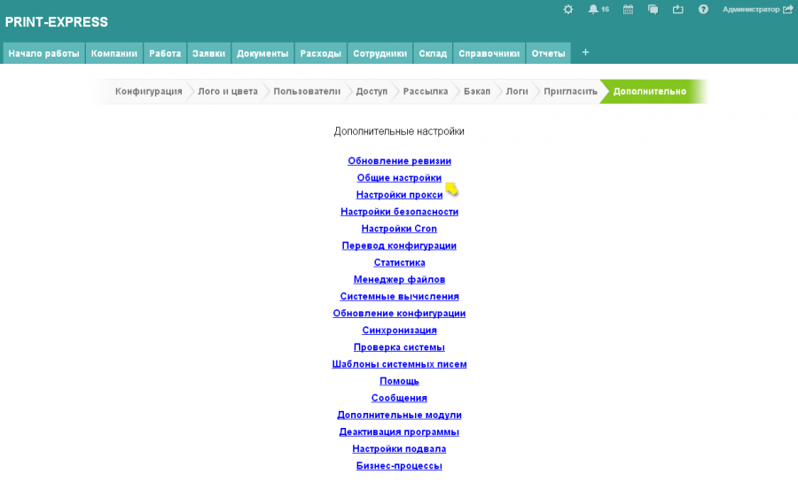

После этого откроется новое окно:

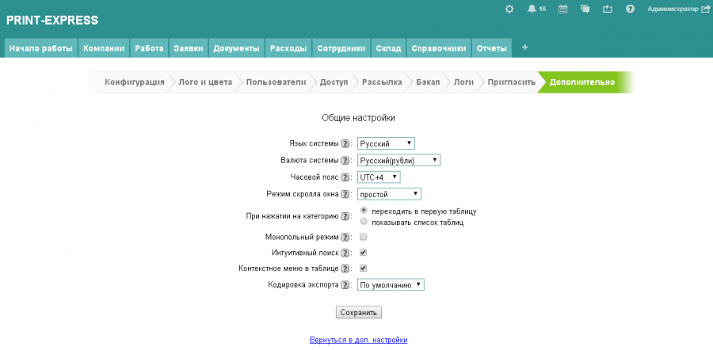

Язык системы — здесь вы можете выбрать один из предложенных вариантов: русский, украинский, польский, английский, немецкий или американский английский. После смены языка, все настройки и инструменты программы будут отображаться на выбранном языке. Однако, категории, таблицы и поля будут на том языке, на котором они были добавлены до смены языка.

Часовой пояс — укажите здесь ваш часовой пояс. Это необходимо для корректного отображения времени добавления различных записей в таблице, а также срабатывания напоминаний.

Режим скролла окна — простой или расширенный. Если вы выберете расширенный скролл, то при горизонтальной и/или вертикальной прокрутке шапка страницы будет оставаться на месте — это удобно, в случае если в таблице очень много полей видно в табличном виде.

При нажатии на категорию — настройка, которая устанавливает способ отображения таблиц. Вы можете либо переходить сразу в первую таблицу по умолчанию, либо выбрать из выпадающего меню нужную таблицу. 

Второй вариант удобен, в случае если каждая категория содержит несколько таблиц, календарей или представлений, так как экономит время при переходе.

Монопольный режим — совершать действия в программе сможет только один пользователь, который изначально выбрал в настройках «монопольный режим». Это режим нужен, чтобы другие пользователи не могли изменять данные и настройки в одно и то же время. Например, устанавливать глобальные настройки, добавлять сложные вычисления. 

Интуитивный поиск — поиск идет по символам, которые были введены или транслитерированны. Если опция выключена, поиск по таблице будет осуществляться по тем символам, которые были введены в поле для поиска.

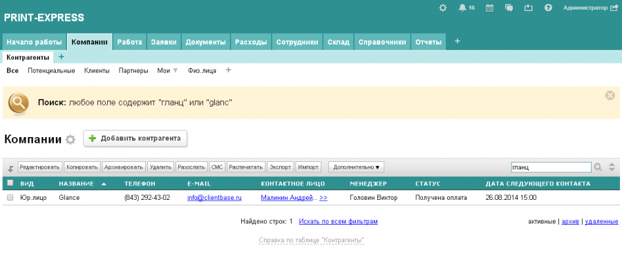

Контекстное меню в таблице — если поставить галочку в этой графе, совершать операции с записями в таблице можно будет при помощи контекстного меню. Оно появится при клике на запись правой кнопкой мышки. 

Выбор действий соответствует конкретной таблице и содержит как стандартные операции (редактировать, копировать и т. д.), так и дополнительные действия, если они содержатся в данной таблице.

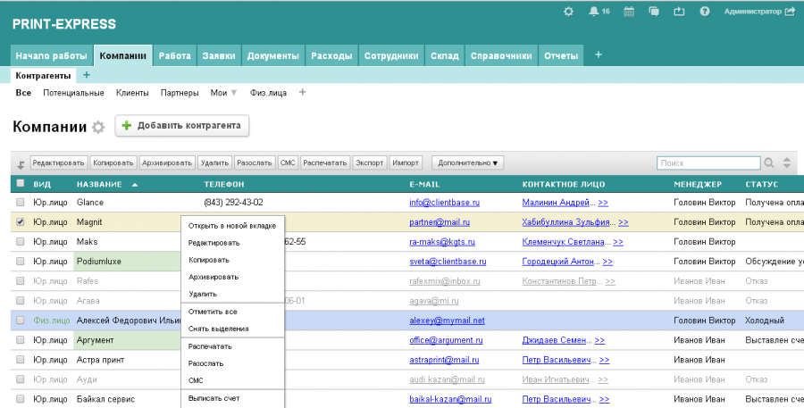

Горячие клавиши — опция которая позволяет использовать специальные комбинации клавиш, призванные упростить и ускорить работу.

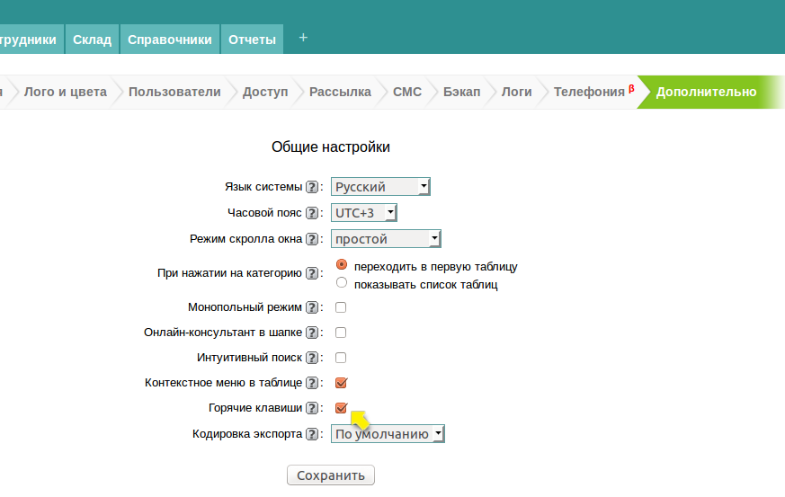

Список горячих клавиш, которые вы можете использовать при работе с платформой:

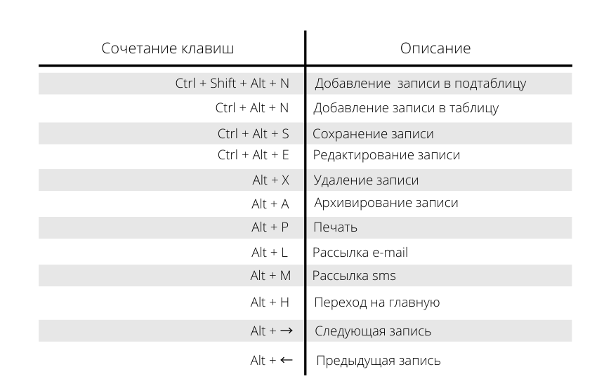

Кодировка экспорта — это одна из дополнительных функций в каждой таблице. Вы можете экспортировать данные в файлы с расширением csv и указать в какой кодировке они будут отображаться. Возможные варианты: Windows 1251, UTF-8, KOI8-R, CP886 (DOS), ISO 8859-1.

## Добавьте первых клиентов

В стандартной конфигурации все таблицы пустые. Поэтому, на примере добавления клиентов в таблицу «Контрагенты» вы научитесь добавлять любые записи в уже созданные таблицы в программе. 

Чтобы это сделать, перейдите в категорию «Компании», таблицу «Контрагенты» и нажмите на кнопку «Добавить компанию».

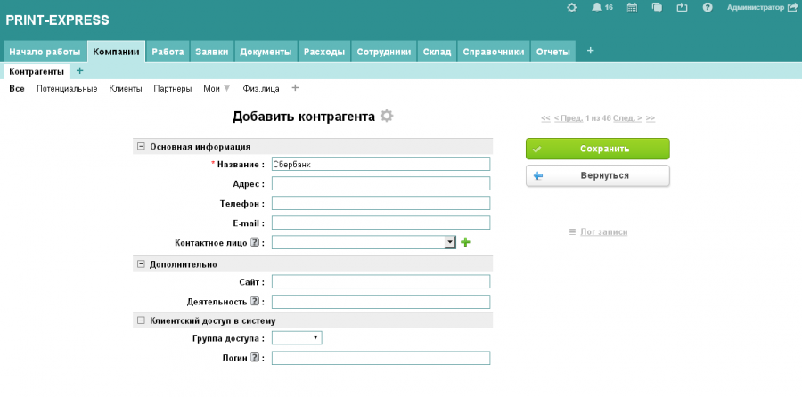

Заполните данные по компании. Все поля заполняются стандартно, как в примере с заполнением данных для вашей компании. Поле «Контактное лицо» содержит пустой список и знак плюс. Это поле типа «Связь», оно берет значения из другой таблицы «Сотрудники клиента» и так как в данной таблице пока нет записей, то список пустой. 

Чтобы его заполнить, нажимаем кнопку «Сохранить». После сохранения записи, у появятся дополнительные поля и подтаблицы, если они предусмотрены.

Все поля не отображаются сразу при добавлении записи, чтобы было проще и быстрее добавлять компании. Какие поля должны заполняться при добавлении, а какие при редактировании — администратор задает в «Настройках».

Чтобы добавить физическое лицо в таблицу «Контрагенты», укажите фамилию, имя, отчество в поле «Название» и сохраните запись. Затем нажмите на кнопку «Редактировать» и в открывшейся форме поменяйте значение в поле «Вид» на «физ.лицо». Теперь в карточке клиента появятся  другие поля в блоке «Реквизиты», а данные из поля «Название» буду автоматически перемещены в поле «ФИО».

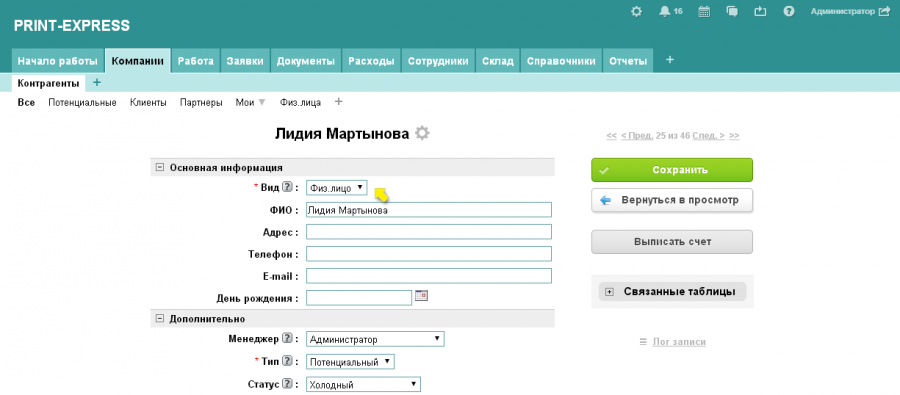

## Добавляем сотрудников

Важное преимущество программы — с базой работаете не только вы, но и все сотрудники вашей компании в режиме онлайн. Это позволяет поддерживать в актуальном состоянии все данные по клиентам: историю работы, контактную информацию и другие. В настройках вы всегда можете задать или ограничить сотрудникам доступ к таблицам и полям. 

Чтобы добавить в таблицу «Сотрудники» еще одного сотрудника вашей компании, нужно и отправить ему приглашение для работы в системе. Для этого зайдите в категорию «Сотрудники» — таблицу «Наши сотрудники» и нажмите на кнопку «Добавить сотрудника».

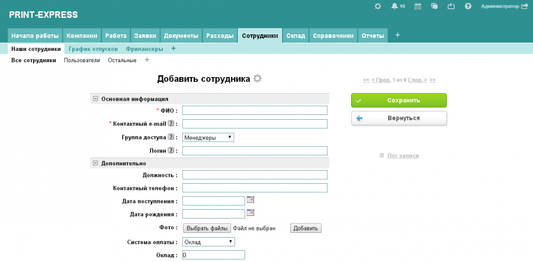

Заполните все необходимые поля, особенно поле «Контактный e-mail»: на указанный почтовый ящик пользователю придет приглашение с данными для входа в систему — логин и пароль. Логин задаете вы, пароль генерирует система. 

Выберите «Группу доступа» сотрудника. В стандартной конфигурации доступны три группы доступа: администратор, менеджеры и клиенты. 

Пользователи из группы «Администратор» обладают полным доступом к базе и к ее настройкам, поэтому рекомендуем назначать эту группу только в случае необходимости.  

Пользователи группы «Менеджеры» могут добавлять клиентов и выписывать счета, но не обладают доступом к настройке системы. 

Пользователи группы «Клиенты» также не обладают правами настройки системы. Однако, для них можно настроить доступ только к трем таблицам вместе со всеми их подтаблицами — начиная с видимости таблицы для пользователя и заканчивая расширенными правами доступа. 

Вы как владелец конфигурации по умолчанию находитесь в группе «Администратор».

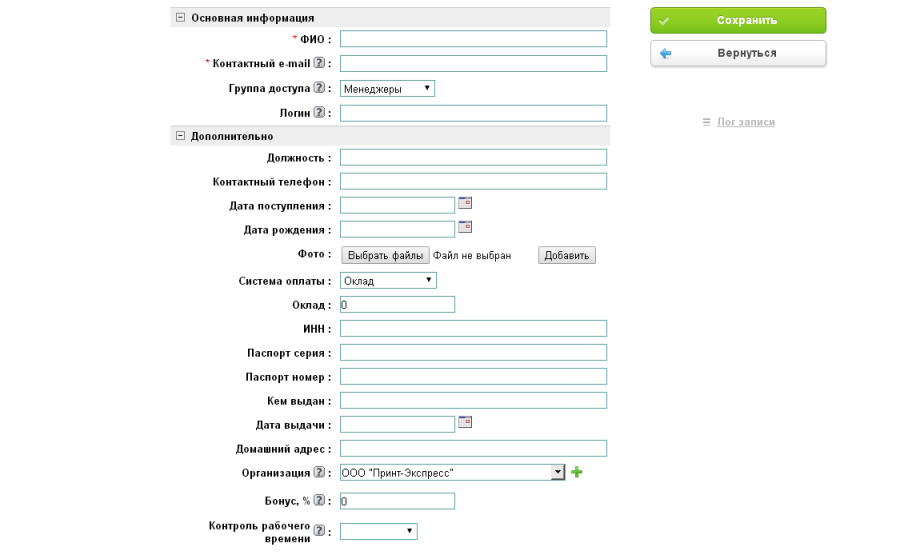

В группу полей «Дополнительно» можно внести информацию о пользователе для формирования актуальной базы данных сотрудников вашей компании. Поле «Бонус» связано с отчетом «По продажам» и влияет на итоговую сумму продаж. В это поле внесите процент бонуса, который будет получать менеджер с оплаченных сумм по выписанным счетам.

После сохранения записи, добавленному сотруднику автоматически будет отправлено письмо для доступа к системе. В письме указываются URL-адрес системы, логин и пароль для входа.

Как только он войдет в систему — увидит все изменения, которые вы внесли. Теперь он сможет вносить изменения в базу в соответствии с определенными для него правами.

В бесплатной версии программы кроме администратора можно добавить только девять дополнительных сотрудников-пользователей. 

## Активность пользователей и логи

Чтобы следить за активностью сотрудников и просматривать вход в систему, добавление и редактирование таблиц, администратору систему нужно зайти в представлением «Активность». Оно расположено в категории «Начало работы».

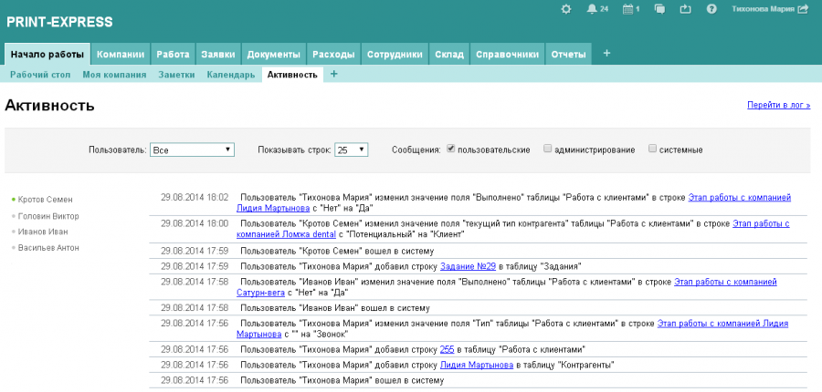

Также он может использовать инструмент «Логи», он находится в «Настройках».

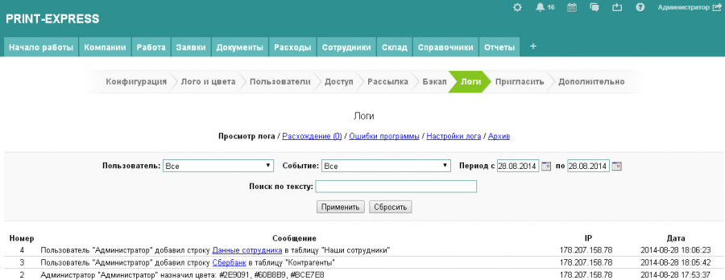

В этом уроке вы познакомились с интерфейсом программы, научились добавлять сотрудников и клиентов. Чтобы закрепить полученные знания, выполните самостоятельно задание:

Добавьте несколько своих компаний в ручном режиме, а затем добавьте одного сотрудника в любую из компаний. Попросите сотрудника, которого вы пригласили в систему, также добавить несколько компаний в таблицу «Контрагенты».
