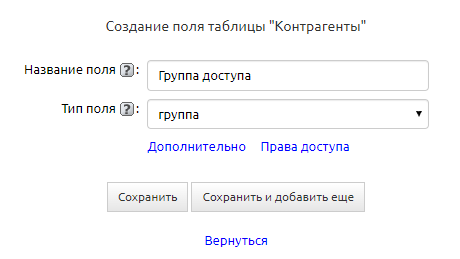

# Типы полей

::: tip Важные моменты
1. В любой версии CRM программы вы можете создавать столько таблиц и полей в этих таблицах, сколько вам нужно: в системе нет ограничений на количество таблиц и полей.
2. В любую таблицу вы можете добавлять поля любых типов.
:::

[[toc]]

## Общие настройки
Вне зависимости от типа в настройках поля всегда можно настроить следующие моменты:
* Обязательное для заполнения — ставится галочка, если необходимо, чтобы при добавлении новой записи это поле обязательно заполнялось значением.
* Запрещать дублирование значений — ставится галочка, если необходимо, чтобы в таблицу невозможно было добавить новую запись со значением, которое уже имеется в этом поле у другой записи.
* Расположение — указывается, после какого поля должно располагаться поле, которое мы сейчас редактируем.
* Ширина поля — указывается ширина в пикселях, которую будет занимать поле в таблице и в подтаблице.
* Префикс поля — указывается текст, который будет показываться перед значением при просмотре поля в таблице или записи.
* Постфикс поля — указывается текст, который будет показываться после значения при просмотре поля в таблице или записи. 
**Важно:** При указании префиксов и постфиксов поля можно использовать следующие bb-коды: noparse, b, i, u, sup, sub, strike, s, left, right, center, color, size, email, url, img, list.
* Javascript — заполняется кодом вычисления на языке javascript. Указанное здесь вычисление будет работать исключительно при просмотре записи.
* Справка по полю — заполняется справочной информацией по полю. Эта информация будет доступна для просмотра при наведении на знак вопроса рядом с полем при просмотре записи, а также в справке, выводимой внизу страницы при просмотре таблицы.
* Права доступа — настройка прав доступа сразу для всех вариантов отображения (таблица, просмотр записи, подтаблица, добавление записи) и групп доступа.

## Число
Данное поле предназначено для хранения числовых значений.

Для этого типа поля уникальными являются следующие настройки:
* Число знаков всего / после запятой — указывается общее количество знаков, которое можно внести в поле, а также какое количество из этого числа возможно указать после запятой. Соответственно, если мы запишем, что число знаков всего равно 10, а число знаков после запятой 2, то максимальное число, которое возможно будет записать в поле с такими настройками будет 9999999,99.
* Минимальное число выводимых цифр — указывается минимальное количество знаков, которое должно быть в поле. Если количество введенных знаков меньше, чем количество, указанное здесь, то в значение будут добавлены нули слева. Например, если это количество равно 4, число «1» выведется как «0001».
* Считать итоговую сумму — если данная опция включена, то в таблице (или в подтаблице) под столбиком со значениями этого поля будет выведена сумма всех значений на текущей странице и всего по таблице. Если в таблице или в фильтре задана группировка по полю, сумма будет считаться по каждой группе отдельно.
* Считать среднее значение по полю — если данная опция включена, то в таблице (или в подтаблице) под столбиком со значениями этого поля будет выведена сумма всех значений, а также среднее значение по полю.
* Значение по умолчанию — указывается значение, которое будет выводиться в поле при добавлении новой записи в таблицу. В отличие от других типов полей здесь можно указать варианты:
  - Конкретное число.
  - «Автонумерация» — когда для каждой следующей добавленной записи в этом поле будет указываться число на «1» больше. При этом возможно указать, с какого числа нужно начать автонумерацию.
  - «Случайное» — когда в поле указывается случайное число, но не больше максимально возможного значения.
* Редактировать в таблице — Если данная опция включена, то значение в поле возможно отредактировать сразу при просмотре записи в таблице.
* Отображать на панели фиксированного поиска — если данная опция включена, то название поля будет выведено при просмотре таблицы и, введя значение рядом с ним, вы сможете провести поиск. Подробнее.
 

## Дата/время

Данное поле предназначено для указания даты и времени.

Для этого типа поля уникальными являются следующие настройки:

* Отображать время — если данная опция включена, то кроме даты возможно будет указать также и время, вплоть до минут. А при редактировании поля будет доступен не только календарик для выбора даты, но и ползунки для указания часов и минут.
* Значение по умолчанию — указывается значение, которое будет выводиться в поле при добавлении новой записи в таблицу. В отличие от других типов полей здесь можно указать варианты:
  - Конкретная дата/время.
  - Дата добавления записи — когда указывается исключительно дата добавления записи.
  - Время добавления записи — данная опция становится доступна, только если включена опция «Отображать время». Позволяет заполнять поле значением даты и времени добавления записи.
* Редактировать в таблице — если данная опция включена, то значение в поле возможно отредактировать сразу при просмотре записи в таблице.
* Отображать на панели фиксированного поиска — если данная опция включена, то название поля будет выведено при просмотре таблицы и, введя значение рядом с ним, вы сможете  провести поиск. 
 

## Текст
Данный тип поля предназначен для ввода данных в виде символьной строки. 

Данный тип поля стоит использовать для любой текстовой информации, включая номера телефонов, реквизиты и другую числовую информацию, с которой нет необходимости производить математические действия. Текстовое поле может быть однострочным и многострочным.

Различия между этими типами:

|       | Однострочное | Однострочное |
| --- | --- | --- |
| Максимальное количество символов      | 256 | неограничено |
| Возможность преобразования значения в гиперссылку   | + | - |
| Возможность использования шаблона заполнения   | + | - |
| Возможность использования html-редактора   | - | + |

Для этого поля уникальными являются следующие настройки:

* Гиперссылка — если данная опция включена, то внесенный в поле url (например, «clientbase.ru») будет преобразован в текст и при клике на него будет открыт браузер (для адресов сайта) или почтовая программа (для почтовых адресов).
* Применять HTML-форматирование — если данная опция включена, то при указании рядом с текстом html-тегов, они будут преобразованы.
* Значение по умолчанию — указывается значение, которое будет выводиться в поле при добавлении новой записи в таблицу.
* Шаблон заполнения — ограничивает шаблоном введение значений в поле.
* Не сокращать в таблице — если данная опция включена, то значение в поле при просмотре в таблице выводится полностью.
* Редактировать в таблице — если данная опция включена, то значение в поле возможно отредактировать сразу при просмотре записи в таблице.
* Отображать на панели фиксированного поиска — если данная опция включена, то название поля будет выведено при просмотре таблицы и, введя значение рядом с ним, вы сможете  провести поиск. Подробнее.
* Шифровать поле — если данная опция включена, то будет возможно скрыть значение в поле, пока не будет введен определенный пароль. Подробнее.
* Подсказка по полю — указывается значение, которое будет выведено для примера в поле при добавлении новой записи в таблицу. Может содержать как подсказку, в каком формате необходимо вносить значение, так и пример значения, которое необходимо внести.
 

## Список

Данный тип предназначен для ввода данных из предустановленного (выпадающего) списка. При настройке поля список значений необходимо вводить, разделяя значения переводом строки.

Для этого типа поля уникальными являются следующие настройки:

* Список значений — указываются значения, из которых возможно будет выбрать при добавлении новой записи в таблицу.
* Множественный выбор — если данная опция включена, то из списка значений галочками возможно будет выбрать сразу несколько значений.
* Значение по умолчанию  — указывается значение, которое будет выводиться в поле при добавлении новой записи в таблицу. В отличие от других типов полей здесь можно указать варианты:
  - Конкретное значение из списка значений. Если в настройках включен множественный выбор — несколько значений.
  - «Случайное» — когда в поле указывается случайное значение из списка значений. 
  - По очереди — значения из списка будут назначаться по очереди.
* Редактировать в таблице — если данная опция включена, то значение в поле возможно отредактировать сразу при просмотре записи в таблице.
* Отображать на панели фиксированного поиска — если данная опция включена, то название поля будет выведено при просмотре таблицы и, введя значение рядом с ним, вы сможете провести поиск. 
* Множественный выбор в фиксированном поиске - возможность отфильтровать записи в фиксированном поиске сразу по нескольким значениям этого поля.

Поле типа «список» может быть преобразовано в поле типа «связь».  Это бывает удобно, когда в процессе работы выясняется, что целесообразнее будет использовать функционал полей типа «связь».

Для того чтобы преобразовать поле, достаточно в его настройках сменить тип со «список» на «связь».

При выборе типа «связь» выйдет системное предупреждение, которое предложит преобразовать данное поле.

Если нажать «Ок», будет автоматически создана связанная таблица с переносом значений типа «список» в виде записей таблицы.

Данная таблица создается по умолчанию либо в категории «Справочники», при условии что в конфигурации имеется категория с аналогичным названием; если такой категории нет, таблица будет создана в текущей категории, что и исходная таблица связи.

Название таблицы формируется на основе названия исходной таблицы связи, в которой находится бывшее поле типа «список» и, собственно, названия этого поля. То есть название представляется в конструкции {Название таблицы.Название поля}:

Название таблицы можно изменить. В целом это обычная таблица, которую можно продолжить настраивать, добавляя новые поля, фильтры, напоминания и т. п.

В старых записях таблицы уже имеющиеся значения в этом преобразованном поле никуда не денутся, не сбросятся. Поля преобразуются в связь, и значения в режиме просмотра записи будут отображаться в виде гиперссылок на записи новой сформированной таблицы.

 
## Связь
Данный тип поля предназначен для создания динамических выпадающих списков, связанных с другой таблицей. 

При работе с полем стоит учесть, что в нем выводятся только первые 50 значений поля из другой таблицы. Начните вводить искомое значение, и в выпадающем списке останутся лишь подходящие по значению записи (даже те, которые в списке первоначально не отображались). После сохранения записи значение в поле «Связь» будет показываться в виде ссылки на запись, значение из поля которого было выбрано.

Также через это поле можно добавлять новое значение в связанную с полем таблицу. При этом, если в связанной таблице есть поля, обязательные для заполнения, то кроме поля, указанного как «Поле связи», будут выведены и они.

Для этого типа поля уникальными являются следующие настройки:

* Поле связи — указывается таблица, а также поле этой таблицы, значения из которого необходимо выводить в выпадающем списке.
* Выводить также поле — указываются дополнительные поля связанной таблицы, из которых нужно выводить значения, относящиеся к выбранному значению.
* Выводить имена полей — если в предыдущей настройке выбраны поля, можно выводить не только информацию, которая в них хранится, но и сами названия полей.
* Выводить в одну строку — при проставлении этой галочки дополнительные поля будут выводиться в однц строку.
* Добавить иконку — выберите поле с изображением для отображения иконки рядом с основным текстом в списке выбора поля связи.
* Фильтр — указывается либо фильтр в связанной таблице, по которому нужно выводить значения полей в связанной таблице, либо другое поле связи в текущей таблице, ведущее на связанную таблицу.
* Значение по умолчанию — указывается значение, которое будет выводиться в поле при добавлении новой записи в таблицу. В отличие от других типов полей здесь можно указать варианты:
  - Конкретное значение из поля связанной таблицы.
  - «Случайное» — когда в поле указывается случайное значение из поля связанной таблицы. 
* Список полей для заполнения — указываются дополнительные поля связанной таблицы, которые необходимо заполнять при добавлении новой записи через поле «Связь». Они будут выведены в дополнение к полю связи и полям, обязательным для заполнения в связанной таблице.
* Не показывать ссылку в таблице/подтаблице — если данная опция включена, то значение в поле выводится как простой текст без ссылки на запись, значение из поля которого было выбрано.
* Не сокращать в таблице — если данная опция включена, то значение в поле при просмотре в таблице выводится полностью.
* Отображать на панели фиксированного поиска — если данная опция включена, то название поля будет выведено при просмотре таблицы и, введя значение рядом с ним, вы сможете провести поиск.
 
### Фильтр по подтаблице
В настройках поля связи есть возможность задать фильтр по подтаблице. Рассмотрим пример, когда это может пригодиться.

Есть таблица “Клиенты” и подтаблица “Сотрудники клиента”, где указываются контакты всех сотрудников вашего клиента, с кем вы держите связь. А в карточке клиента вы хотите указать основное контактное лицо в одноименном поле.

Если просто создать поле связи на таблицу “Сотрудники клиента”, то в нем будут выпадать сотрудники всех клиентов, что нам не подходит.

Поэтому в настройках поля “Контактное лицо” задаем фильтр “по подтаблице “Сотрудники”.

Теперь в поле “Контактное лицо” 

выводятся только те записи, что мы видим в подтаблице.

## Файл
Данный тип поля предназначен для прикрепления к записи файлов. В каждое поле типа «Файл» возможно добавить несколько файлов.

Для этого типа поля уникальными являются следующие настройки:

* Типы файлов — указывается перечень расширений для файлов, которые могут быть загружены в это поле. При необходимости указания нескольких типов файла они указываются через запятую и пробел.
* Максимальный размер (кБ) — указывается максимальный размер для файлов, которые могут быть загружены в это поле. Если в этом поле ничего не указано, то максимальный размер загружаемого в программу файла ограничен лишь настройками сервера.
* Просмотр файла в браузере — включите опцию, если хотите открывать файл в браузере вместо его скачивания. По умолчанию опция отключена и при нажатии на файл всегда открывается диалоговое окно на скачивание файла. В случае если опция включена, будет осуществлена попытка открыть файл в новой вкладке. Успешность попытки зависит от типа файла и способности браузера открывать файлы данного типа. Например, как правило, браузеры позволяют просматривать файлы PDF. В случае если таковой поддержки нет, браузер предложит скачать файл.
 

## Пользователь
Данный тип поля предназначен для выбора пользователей, существующих в программе. Список пользователей настраивается в разделе «Настройки» — «Пользователи».

Для этого типа поля уникальными являются следующие настройки:

* Фильтр по группе — указывается перечень групп, к которым должны относиться пользователи, чтобы попасть в список значений этого поля.
* Множественный выбор — если данная опция включена, то из списка значений галочками возможно будет выбрать сразу несколько значений.
* Значение по умолчанию — указывается значение, которое будет выводиться в поле при добавлении новой записи в таблицу. В отличие от других типов полей здесь можно указать: 
  - Конкретного пользователя из списка пользователей. Если в настройках включен множественный выбор — несколько пользователей.
  - Переменную «Текущий», которая при добавлении записи пользователем будет указывать его в этом поле.
  - Переменную «Случайное» — когда в поле указывается случайный пользователь из списка значений.
  - Переменную «По очереди» — в поле будут указываться пользователи по порядку.
* Отображать на панели фиксированного поиска — если данная опция включена, то название поля будет выведено при просмотре таблицы и, введя значение рядом с ним, вы сможете провести поиск.
* Множественный выбор в фиксированном поиске — если отмечена галочка, вы сможете выбрать несколько значений в фиксированном поиске.
 

## Изображение
Данный тип поля предназначен для прикрепления к таблице иллюстраций. В каждое поле типа «Изображение» возможно добавить несколько файлов. В отличие от поля типа «Файл», в которое также можно добавлять изображения, в данном поле возможно выводить превью загруженного изображения.

Для этого типа поля уникальными являются следующие настройки:

* Размер изображения — указывается размер в пикселях превью для загружаемого изображения. Само изображение при этом сжиматься не будет.
* Максимальный размер (кБ) — указывается максимальный размер для файлов, которые могут быть загружены в это поле. Если в этом поле ничего не указано, то максимальный размер загружаемого в программу файла ограничен лишь настройками сервера.
* Автоматический поворот — данная опция позволяет включить/отключить автоматический поворот изображения при загрузке, исходя из параметра exif orientation.
* Сжимать изображение — данная опция позволяет задать максимальный размер, максимальную ширину и максимальную высоту изображения при загрузке.
* Не обрезать превью — по умолчанию превью обрезается, чтобы вместиться в указанные размеры. Включите эту опцию, если обрезать превью не нужно.
 

## Группа
Данный тип поля предназначен для выбора из списка групп доступа, которые имеются в программе. Список групп доступа настраивается в разделе «Настройки» — «Группы доступа».

Для этого типа поля уникальными являются следующие настройки:

* Показывать группы — в этом поле одна за другой выбираются группы, которые будут доступны в списке значений этого поля.
* Множественный выбор — если данная опция включена, то из списка значений галочками возможно будет выбрать сразу несколько значений.
* Значение по умолчанию — указывается значение, которое будет выводиться в поле при добавлении новой записи в таблицу. В отличие от других типов полей здесь можно указать:
  - Конкретную группу доступа из списка групп доступа. Если в настройках включен множественный выбор — несколько групп доступа.
  - Переменную «Текущий», которая при добавлении записи пользователем будет указывать его группу доступа в этом поле.
  - Переменную «Случайное» — когда в поле указывается случайная группа доступа из списка значений.
    - Переменную «По очереди» — в поле будут указываться группы доступа по порядку.
* Отображать на панели фиксированного поиска — если данная опция включена, то название поля будет выведено при просмотре таблицы и, введя значение рядом с ним, вы сможете провести поиск.